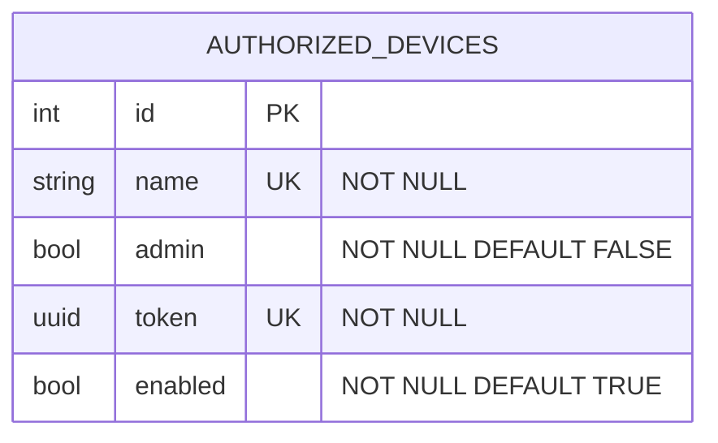

# Ghiotta Server

This server makes an authentication layer for
[matterjs-server](https://github.com/matter-js/matterjs-server),
allowing to create various accounts with layered privileges.

As the server is supposed to be used with as an API server for a mobile
APP, the authentication is carried by a bearer token.

## Why the name "Ghiotta"?

Ghiotta is a recipe originated in Italy where meat, preferably boar pig or chicken, or fish is marinated alongside herbs and spices
into a big pot.

## Roles

The only two roles for the first version is the following:

- **admin:** Can administrate the system by adding new accounts,
  commission matter devices, ecc. ecc.
- **guest:** Can only operate with registered devices, without
  performing any administrative tasks.

## Data model

